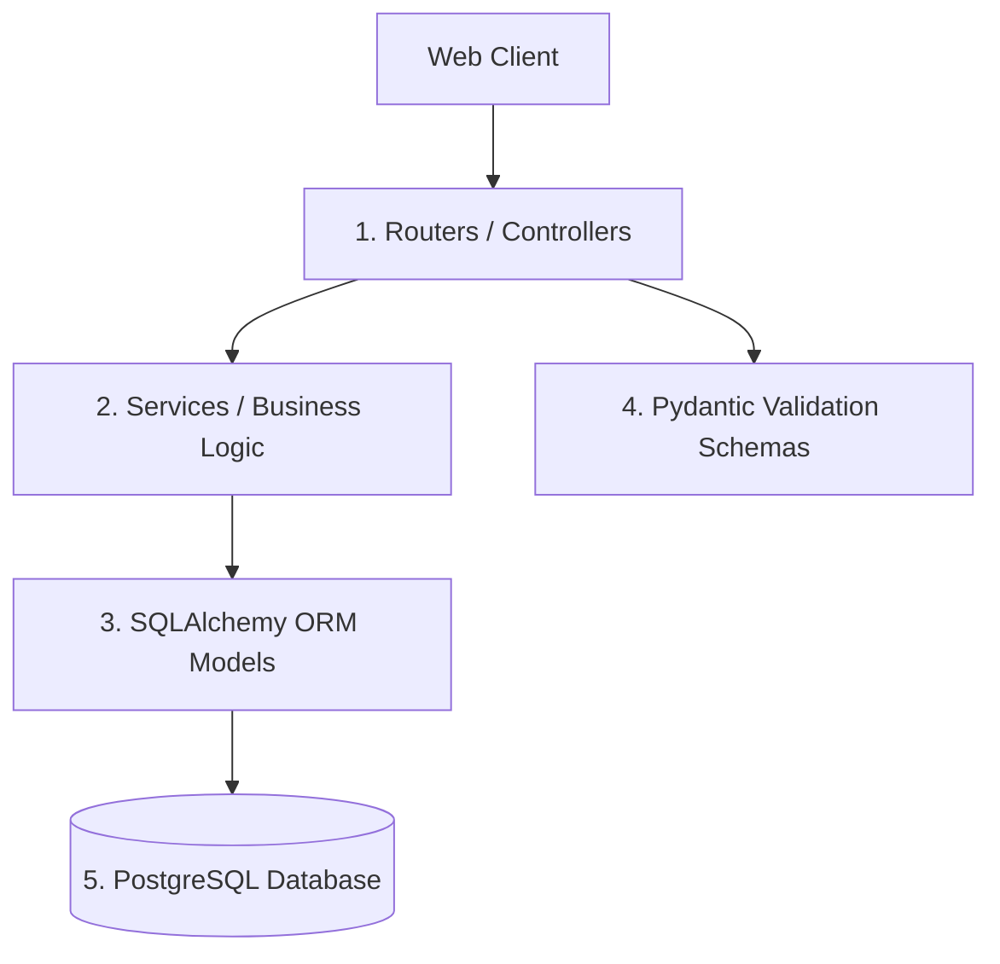
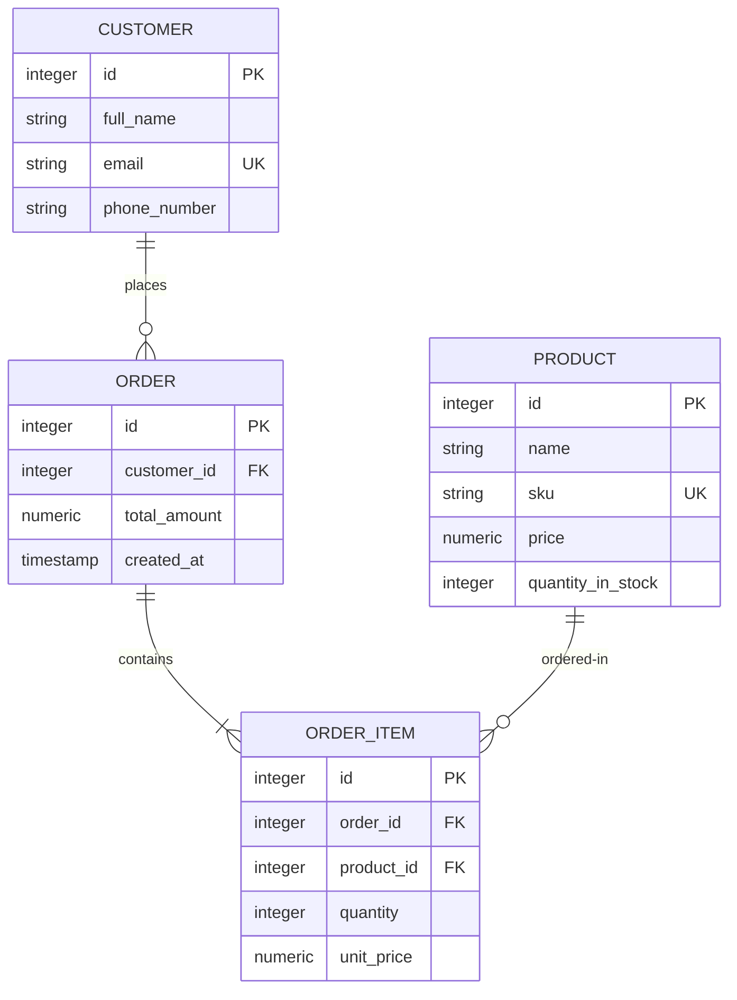

# Architecture & Tech Stack Choices

This document describes the implemented architecture, schema, and important operational trade-offs.

---

## 🏛️ Layered Backend Architecture

The backend follows a strict layered separation of concerns, structured into five clean segments:



1. **Routers (`backend/app/routers/`)**: Handle HTTP requests, parse query/path parameters, and return JSON payloads formatted according to Pydantic responses.
2. **Services (`backend/app/services/`)**: Implement business logic, validate complex cross-entity conditions, manage database transactions, and execute row-level locking.
3. **Models (`backend/app/models/`)**: Define the database tables, data types, constraints, and relationships.
4. **Schemas (`backend/app/schemas/`)**: Define structure-enforcement models (Pydantic) for parsing and validating requests and response payloads.
5. **Database Session (`backend/app/database/`)**: Manages the synchronous SQLAlchemy engine, connection pool, and request-scoped sessions.

The FastAPI route functions are synchronous (`def`), as are the SQLAlchemy sessions and PostgreSQL driver calls. FastAPI runs these handlers in its thread pool; this backend is not currently using SQLAlchemy's async engine.

---

## 🗄️ Database Design (ER Diagram)

The database schema consists of four core tables: `products`, `customers`, `orders`, and `order_items`. Relationships are enforced using foreign keys with cascading options where appropriate.



---

## ⚖️ Technology Selections & Trade-offs

### 1. Web Framework: FastAPI vs Node/Express
- **Selection**: **FastAPI** (Python).
- **Pros**: 
  - Asynchronous event loops natively handle highly concurrent requests.
  - Automatic OpenAPI interactive documents generation (Swagger UI).
  - High performance parsing using compiled Rust in Pydantic.
- **Trade-offs**: Node/Express enjoys a larger ecosystem of packages and middlewares, but FastAPI's native schema compliance and speed make it ideal for data-intensive inventory systems.

### 2. Database: PostgreSQL vs MongoDB (NoSQL)
- **Selection**: **PostgreSQL** (Relational).
- **Pros**:
  - Full ACID transaction guarantees are critical for managing financial invoices and catalog quantities.
- Strict constraints (foreign keys, unique indexes, and numeric checks) ensure database integrity. Email format is validated by Pydantic rather than a database check constraint.
  - Supports row-level pessimistic locking (`SELECT FOR UPDATE`), preventing double-allocating stock.
- **Trade-offs**: NoSQL databases like MongoDB scale horizontally and accommodate unstructured schema changes easier, but inventory calculations require transactional consistency across multiple tables.

### 3. CSS Engine: Tailwind CSS v4.0 vs CSS modules / Tailwind v3
- **Selection**: **Tailwind CSS v4.0**.
- **Pros**:
  - Extremely fast compilation built on the LightningCSS engine.
  - Simplified installation with a single `@tailwindcss/vite` plugin (no configuration file needed).
  - Theme colors and tokens are declared directly as native CSS variables, making override customizations cleaner.
- **Trade-offs**: Tailwind v4 is modern and has minor configuration schema differences from Tailwind v3, but the performance benefits and zero-config setup make it the clear choice.

### 4. Client State: React Single-Page App (Vite) vs SSR Frameworks (Next.js)
- **Selection**: **Vite React Single Page Application**.
- **Pros**:
  - Ultra-fast client-side view refreshes, creating a fluid dashboard experience.
  - Light runtime bundle, making deployment to CDN/Hosting static environments simple.
- **Trade-offs**: SSR structures like Next.js offer better Initial Page Load performance and SEO metadata compilation, which is valuable for consumer-facing storefronts but unnecessary for internal administration consoles.

---

## 🔒 Concurrency Safeguards: Pessimistic Row Locking

When an order is created, the system must confirm that each item is in stock and subtract the quantity *atomically* to avoid overselling. 

To achieve this under concurrent load:
1. A request-scoped SQLAlchemy session begins a transaction implicitly on its first database operation.
2. Inside `backend/app/services/order_service.py`, product records are fetched using `with_for_update()`:
   ```python
   product = db.query(Product).filter(Product.id == item.product_id).with_for_update().first()
   ```
3. PostgreSQL locks these specific rows. Any concurrent connection trying to checkout the same products will wait until this transaction either completes (`COMMIT`) or fails (`ROLLBACK`).
4. Stock quantities are decremented, and the transaction commits. This guarantees that double-booking stock is mathematically impossible.

Order cancellation also locks product rows before restoring inventory.

## Schema lifecycle

`app/main.py` calls `Base.metadata.create_all()` during application startup. This creates missing tables but does not evolve existing columns or constraints. Alembic configuration is present, but no revision is committed. Production deployments should use reviewed, committed Alembic revisions as the schema source of truth and eventually remove startup-driven schema creation.

## Runtime and deployment boundaries

- The frontend is a browser SPA and calls a configurable `/api/v1` base URL with Axios.
- The backend has no authentication or authorization layer.
- CORS currently allows all origins and should be restricted for deployment.
- The repository has no automated tests, container definitions, CI workflow, or production server/process configuration.
